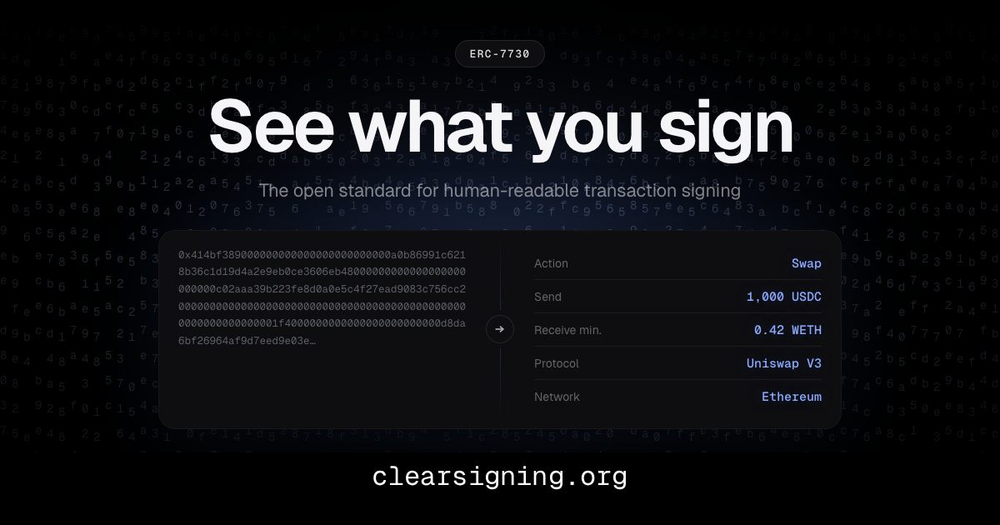

{/* TODO: link to the announcement post on @sourcifyeth X account — full URL, e.g. https://x.com/SourcifyEth/status/XXXXXXXXXXXXXXXXXXX */}

Today, the Ethereum Foundation's Trillion Dollar Security Initiative and a working group spanning wallet, hardware, security, and infrastructure teams are launching [Clear Signing Working Group](https://clearsigning.org/), to end blind signing on Ethereum. It ships as an open standard ([ERC-7730](https://eips.ethereum.org/EIPS/eip-7730)), a neutral registry, an attestation framework, and developer libraries. Sourcify is one of the contributors.

For years, Sourcify has been concerned about what we see as one of the biggest missing pieces in the Ethereum stack: even when source code is verified and open, users still cannot meaningfully read what they are about to sign.

This is not a new concern for us. Back in 2023 we started a [Working Group on Human-Readable Transactions](https://docs.sourcify.dev/blog/human-readable-txs-wg/), and [revisited the whole problem space](https://docs.sourcify.dev/blog/human-readable-txs-learnings/) in March 2025 after the ByBit hack. In fact it's been years we have been thinking about the blind signing problem and advocating to find the right solution.

We are glad to now be part of a working group, with an open spec and a neutral registry, that is finally positioned to solve this problem once and for all.

<!-- truncate -->

## What is shipping

Four pieces, designed to fit together:

1. **An updated [ERC-7730](https://eips.ethereum.org/EIPS/eip-7730)** standard for human-readable transaction descriptions. This is the schema for "descriptors": JSON files that translate a contract call from raw calldata into something a person can actually read.
2. **A neutral, [off-chain registry](https://github.com/ethereum/clear-signing-erc7730-registry)** for distributing those descriptors, hosted by the EF and independently mirrorable by anyone.
3. **An attestation framework** defined by [ERC-8176](https://github.com/ethereum/ERCs/pull/1576) and built on the [Ethereum Attestation Service](https://attest.org/), so that independent reviewers can vouch for whether a descriptor faithfully represents what the underlying contract actually does. Wallets decide whose attestations they trust.
4. **Developer libraries** in TypeScript and Rust, for wallet integration, descriptor authoring, and attestation workflows.

We'd like to thank Ledger, who have been pushing on this for years and originated ERC-7730 itself, along with the early tooling and the first registry. The version landing today builds directly on that work.

## Why this version works

**A mature open spec.** ERC-7730 has grown into a standard that covers most real-world contract interactions, from simple calls to nested calls and multicalls. It is no longer a draft to bet on; it is a spec ready to implement against today.

**A neutral home.** The registry has the EF as its initial host and neutral steward. The working group itself spans wallets, hardware vendors, security firms, infrastructure, and tooling teams committed to keeping the registry neutral and open over the long term. On top of this, anyone can fork the registry.

**An open attestation layer.** Independent auditors and security firms can attest that a descriptor faithfully represents what the underlying contract does, using [ERC-8176](https://github.com/ethereum/ERCs/pull/1576) on the Ethereum Attestation Service. Wallets define their own trust policies by choosing whose attestations they honor.

**Critical mass on the contributor side.** Ledger, Trezor, MetaMask, WalletConnect, Keycard, ZKnox, Cyfrin, Blockaid, Fireblocks, Zama, Sourcify, Argot, the EF, and a long tail of independent contributors. With a list like this, ERC-7730 is an ecosystem standard rather than a single-vendor one.

## Sourcify's role: tooling and data

We are contributing on two fronts.

On the tooling side, we will help steward the open-source libraries and developer tools around the registry, with a focus on making the developer experience for protocols, auditors, and wallet integrators as smooth as possible. Good DevX is what turns a spec into adoption.

You can already see the Typescript SDK in action at [https://clear-signing.sourcify.dev](https://clear-signing.sourcify.dev). The code is at [https://github.com/sourcifyeth/clear-signing](https://github.com/sourcifyeth/clear-signing).

On the data side, contract verification remains a must. We will be contributing Sourcify's open, multi-chain dataset of over 28 million verified contracts across 180+ EVM chains, the ABIs and metadata that come with them, and the domain-specific knowledge we have built around contract bytecode and metadata over the years.

## What we are asking

- **Protocols:** publish descriptors for your contracts. If you want users to trust what they sign, give them something to read.
- **Auditors:** attest. The trust graph only works if reviewers actually plug in.
- **Wallets:** integrate the libraries. Make blind signing the exception, not the default.
- **Anyone:** mirror the registry. The whole point is that no one has to trust the host.
- **Users:** stop signing things you cannot read.

More at [clearsigning.org](https://clearsigning.org/), and watch [@SourcifyEth](https://x.com/SourcifyEth) for the registry and tooling side as we ship.
