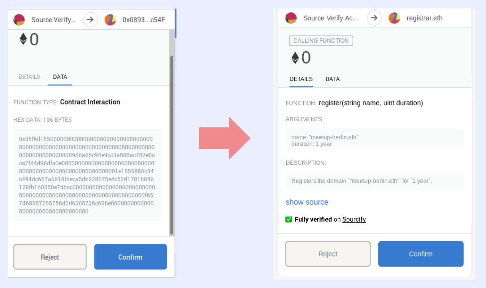

# Human-Readable Transactions Working Group

:::tip TLDR;

Human-readability of Ethereum Transactions is a multi-faceted and complex problem that requires ecosystem-wide collaboration. Therefore, it makes sense to create a working group to gather people, projects, and knowledge.

:::

## Motivation

It is a well-known UX problem in Ethereum that users usually don't/can't verify the action they are about to take, because they are not presented with human-readable information. This has led to social engineering hacks where victims lost millions. [In one case](https://www.coindesk.com/markets/2020/12/14/ceo-of-defi-insurer-nexus-mutual-hacked-for-8m-in-nxm-tokens/), a hacker was able to replace the browser wallet, which made the victim sign a `transfer` transaction on his HW wallet that sends all the tokens to the hacker. [In another](https://cointelegraph.com/news/moonbirds-creator-kevin-rose-loses-1-1m-in-nfts-after-1-wrong-move), the hacker created an offline signature for the victim to list all his NFTs for free.

As a basic example, our goal is to show something similar to the one on the right rather than on the left.

Nowadays, many wallets can do the basic ABI decoding and show a verified contract link but users still lack a description of the action they are about to take and additional safety information about the contract they are going to interact with.

How we achieve this at Sourcify is through the [NatSpec](https://docs.soliditylang.org/en/latest/natspec-format.html) documentation. If you document your code using NatSpec's `@notice` and `@dev` fields and [fully verify](https://docs.sourcify.dev/docs/exact-match-vs-match/) your contract on Sourcify, the wallet can show the users the description you wrote when calling the function. (details [in this talk at Devcon VI](https://www.youtube.com/watch?v=Ggm82pnalCI) or [this lightning talk](https://www.youtube.com/watch?v=D7gZtHel8Lg)).

Over time it became clear to me that even if we convince the majority of developers to document using NatSpec and fully verify on Sourcify, this single route won't solve this wicked problem of **Human-readable Transactions**. The problem is multi-faceted and requires different approaches for different cases. For instance, you can't add NatSpec docs to an already deployed contract, or you can't use [Dynamic Expressions](https://docs.soliditylang.org/en/latest/natspec-format.html#dynamic-expressions) for a commit-reveal transaction (e.g. ENS commit).

Actually, there are different approaches, some of which we gathered in the [Sourcify docs](https://docs.sourcify.dev/docs/additional-resources/#human-readable-contract-interactions--signatures). Unfortunately, most of them seem to be stale.

Another motivation for us has been the lack of knowledge of what's going on in the space. Even though we were working on this problem, we haven't been aware of the following for a long time:

- I wasn't aware of the two EIPs [EIP-4430: Described Transactions](https://eips.ethereum.org/EIPS/eip-4430) and [EIP-3224: Described Data](https://eips.ethereum.org/EIPS/eip-3224) for a long time. Similarly, I didn't know [(Draft) EIP: Rich Site-Proposed Contract Metadata](https://ethereum-magicians.org/t/eip-rich-site-proposed-contract-metadata/9635)
- Although we mostly think of the software wallets when thinking about human readability, the hardware wallets work in a much more contained environment and need different approaches ([Illustrated by alexmiller.eth from GridPlus](https://mirror.xyz/alexmiller.eth/kiwpU01XZh-rCgDDRA-jB2-pjosjogGIqCZkxryZ9Oo))
- Until Devcon 6, we weren't aware of the Rosette Protocol and that they'd written [radspec in Typescript](https://github.com/RosetteProtocol/rosette.ts/tree/main/packages/rosette-radspec), which was what we needed.

**Solving this problem of transaction human readability is hard and is and requires ecosystem-wide collaboration.**

For this reason, it makes sense to form a "Human-Readable Transactions Working Group" focused on this specific problem with different interested parties

## Scope

How do we define the scope?

Our starting point is the **human-readability** of the transactions but this really cannot be separated from the **safety**, **UX** and **human-friendliness**. Depending on the progress, other UX and safety aspects are expected to be included in the general work (audits, token registries etc.). Initially, it's called “human-readable tx's WG”, but we'll see where it goes.

The work will mostly be on EVM, but not specific to the Ethereum network.

## Goals

- **🎯 Being the Schelling Point**: Gather different parties working on the transaction readability, security, and UX in the same place. Enable collaboration between parties, and make sure everyone knows who's working on what.
- **📚 Being the knowledge base**: Discuss and compile the different approaches to the problem. Lay out the advantages and disadvantages of different methods. Document them for the public.
- **🌟 Open-source the solutions** to solve it once and for all.

The goal, however, is not to work on a single agreed solution to the problem. As said, there is no single solution to this problem due to its complexity and context dependence. Likely, there will be conflicts and forks, and each team will focus on what they think is the best way. Ideation and active feedback should allow us to reach the best solutions faster.

## Structure

This is also a TBD but one potential place for this WG is [CASA](https://github.com/ChainAgnostic/CASA).

## Interested?

Are you working on similar problems and want to collaborate? Reach out to me on Twitter [@kaanuzdogan](https://twitter.com/kaanuzdogan), Matrix [@kuzdogan:matrix.org](https://matrix.to/#/@kuzdogan:matrix.org), or Telegram (@kuzdogan)!
