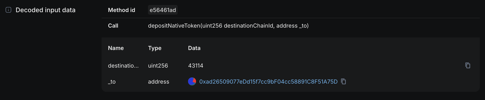
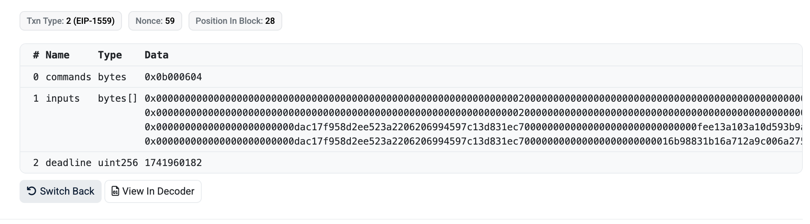

import "./style.css"
import blindSign from "./blind-sign-meme.jpg"
import oldHero from "./old-hero.png"
import dog from "./dog.png"

In the earlier days of Sourcify, there were other things we were focusing besides source-code verification. Sourcify was there to foster the adoption of the Solidity metadata and to make transactions **human-readable**. 

Since September 2021, I've been the only one working on the project until Marco joined on XXX. You will see in our earlier talks we start with the problem statement of ["YOLO signing"](https://youtu.be/D7gZtHel8Lg) and explain how Sourcify, Solidity metadata.json, and NatSpec can solve this. That talk is actually my first ever conference talk (can be seen from how nervous I am), and I was naive. The idea was that if you document your Solidity methods with NatSpec, this userdoc/devdoc will be in the metadata.json and you can use these human-readable messages to tell the user what is going to happen before calling this contract method (more below). 

<div className="image-container">
  
  <p style={{fontSize: "0.85rem", color: "gray"}}><em>The old Sourcify website highlighting human-readable transactions as a key feature</em></p>
</div>


Getting more familiar with the problem, soon I realized this huge problem can't be solved with metadata.json + NatSpec only. We had to attack the problem from different angles for different cases. This led us to start the initiative ["Human-Readable Transactions Working Group"](/blog/human-readable-tx-wg/) (kudos to [Dustin](https://x.com/luminoir) and [Karen](https://x.com/cryptoecongames) for the help) with actually many people ranging from Safe, Metamask, Coinbase Wallet etc. We held multiple calls but unfortunately we as Sourcify couldn't continue our coordinating role and the initiative died. Marco and I didn't have enough bandwidth and experience, and had to go back to focusing on our core value proposition of making source-code verification open-source and the verified contract data open and accessible. 

<div className="responsive-container">
  <div className="image-container float-left">
    
  </div>
  
  <div>
    <p>The problem of blind-signing turned out to be a bigger dragon that we can slay.</p>
    <p>Still we learned a lot and I got to see what people have been proposing to solve this. Following the <a href="https://x.com/kaanuzdogan/status/1894870106288857229" target="_blank" rel="noopener">ByBit hack</a> that was essentially caused by blind-signing, I'll take this chance to gather everything we've learned here and hare with everyone. There has been countless cases of people losing significant amounts of money because of blind signing. But the ByBit hack, the biggest hack ever in the crypto history, with 1.4 billion USD stolen, has brought the attention back to this issue</p>
  </div>
</div>

I started this article with blind-signing but the problem is actually even larger: it's transaction safety. It means nothing if you can read a transaction but it does not to what you read or if you're talking to the wrong contract. It's layers and layers and layers of security. Which also means layers and layers and layers of coordination effort. That's why it's so difficult.


:::note
By no means this is a complete guide. I'm more than happy to extend this. Please get in touch if you have anything to add!
:::

# Transaction Safety

## 1. Source Code Verification

This is a MUST. Period. Without verification there's no way to tell what a contract really does. 

DO NOT INTERACT WITH CONTRACTS THAT ARE UNVERIFIED

The contract should be verified by a verifier, but ideally it is verified at multiple places. Even better if the verification is a ["perfect/exact match"](/docs/full-vs-partial-match/), this gives you a cryptographic guarantee what you see is exact what the contract author deployed, byte-by-byte.

Players here: [Blockscout](https://www.blockscout.com), [Etherscan](https://etherscan.io/), [Routescan](https://routescan.io/), [Tenderly](https://tenderly.co/), Sourcify, and the [Verified Alliance](https://verifieralliance.org/) initiative.

Wallets MUST warn users about unverified contracts and use multiple sources to check verification. Unfortunately, even in 2025, not many do even this simple requirement. 

The tricky thing here is to not lead the user to believe verified == safe. A verified contract can still be malicious and verification does not check what the contract does.

## 2. Labeling

The second step is to make sure you are talking to the correct contract. You think you are making a swap on Uniswap but is it really Uniswap or just a verified Uniswap copy at another address? Maybe the contract you are talking to is already marked malicious and it'd be such a shame to lose money to an already known scammer. 

So this entails whitelists and blacklists of contracts. I don't have deep knowledge around this but I don't really recall seeing contract labels in my wallets. There are "web3 security" companies or Etherscan labels but the problem with these is everyone solves it for themselves. 

I'll be saying this many times: 

**In order to solve this problem once and for all, THE SOLUTION HAS TO BE OPEN.** 

Closed. siloed data will only get us so far. 

Here the project I want to highlight is the [Open Labels Initiative](https://openlabelsinitiative.org/) stewarded by [growthepie.xyz](https://www.growthepie.xyz/). If there are other solutions/projects worth sharing, please share them.

## 3. Audits

This is part of labeling but it deserves it's own mentioning. We need open, public audit lists of contracts. Wallets need to show if the contract you are about to interact with is audited and if not warn you against this.

The second step could be to create a ranking/reputation system of auditors, as you all know, not all auditors are created equal. And again, all these lists MUST be open and public. Note that I don't mean "decentralized" necessarily. A good enough centralized solution is better than nothing as long as the data is fully open, not monetized, and incentives are aligned to keep it that way. This can be an alliance of multiple parties, or a project sustained by grants. As you can see, this by itself is already a big enough problem to solve. 

This is also not a part of the ecosystem I'm not too knowledable in so please share what you know.

## 4. Human-Understandability of Transactions

I named this "understandability" instead of "readability" because readability is just a necessary but non-sufficient part of our main goal ie. being able to undertand what you are doing. Reading `swapTokensForExactTokens` is quite a meaningless word for a normal person, even though readable. If you have no idea, what you're doing, you're basically giving out your money.

<div style={{display: 'flex', flexDirection: "column", alignItems: 'center'}}>
  
  <div style={{textAlign: 'center', marginTop: '0.5rem', color: 'gray', fontSize: '0.9rem', fontStyle: "italic"}}>
Dog-readable transactions, anyone?
  </div>
</div>


## ABI-Decoding

It's year 2025 and I can't believe I have to mention this.

By now it should be trivial to take the ABI JSON of a contract (verification required), and decode the calldata. 

Most of the times this is not really helpful to the user though. 

Tx [0x5a45979e2a4a22855a1a2aee1ecb346b4ecee2d4e498817e8ed98d86476809ce on Mainnet](https://eth.blockscout.com/tx/0x5a45979e2a4a22855a1a2aee1ecb346b4ecee2d4e498817e8ed98d86476809ce)

If you're given only the raw calldata:

```
0xe56461ad000000000000000000000000000000000000000000000000000000000000a86a000000000000000000000000ad26509077edd15f7cc9bf04cc58891c8f51a75d
```

A really simple decoding yields a much more meaningful message (decoded in Blockscout):



This is incredibly straightforward, just pull the ABI from a verifier, and decode with a framework like in ethers.js: `abiCoder.decode(abiParamInputs, calldata)`. It's really sad even this is lacking in a lot of the places.

ABI-decoding is not always this helpful though. Usually the called methods have a lot more complex arguments and not as simple as the one above.

## Function Metadata

This category refers to leveraging function metadata, apart from the function itself (e.g. ABI) provide more information about it.

### ABI-Decoding + NatSpec

There's additional human-readable information found in well written Solidity contracts in the form of [NatSpec](https://docs.soliditylang.org/en/v0.8.29/natspec-format.html), a commenting syntax.

NatSpec has `@notice` and `@dev` fields that are intended to explain the "user" and the "developer" respectively what this method does, as well as the `@param` method to document the "parameters".

Example from my talk at the [BlockSplit 2022](https://youtu.be/VlVFxpgLG-U?t=159) conference ([link to slides](https://docs.google.com/presentation/d/1R9kYOmvrAn6Tur2etZbBRdEFPvyByM3eYJAjqDDyFR8/edit?usp=sharing)):
```js
  /// @dev Allows to swap/replace an owner from the Safe with another address.
  ///      This can only be done via a Safe transaction.
  /// @notice Replaces the owner `oldOwner` in the Safe with `newOwner`.
  /// @param prevOwner Owner that pointed to the owner to be replaced in the linked list
  /// @param oldOwner Owner address to be replaced.
  /// @param newOwner New owner address.
  function swapOwner(
      address prevOwner,
      address oldOwner,
      address newOwner
  ) public authorized {...
```

So that a user can see a more human-readable message about the method they are calling:
```yaml
userdoc: Replaces the owner `oldOwner` in the Safe with `newOwner`
devdoc:  Allows to swap/replace an owner from the Safe with another address. This can only be done via a Safe transaction.
function: swapOwner(address prevOwner, address oldOwner, address newOwner)
  - prevOwner:
    - documentation: Owner that pointed to the owner to be replaced in the linked list
    - value: 0x1F98431c8aD98523631AE4a59f267346ea31F984
  - oldOwner:
    - documentation: Owner address to be replaced.
    - value: 0xcC60F45e0507032036033b361d3a6457b9F0283D
  - newOwner:
    - documentation: New owner address.
    - value: 0x83D0360050703233b361d3a6457b9F2cC60F45e0
```

Additionally NatSpec also suggests using ["dynamic expressions"](https://docs.soliditylang.org/en/v0.8.29/natspec-format.html#dynamic-expressions) to put variable names in backticks like \`oldOwner\` for the consumers of the spec to dynamically fill the values. With that a user calling this function can see a much more human readable message:

```yaml
userdoc: Replaces the owner 0xcC60F45e0507032036033b361d3a6457b9F0283D in the Safe with 0x83D0360050703233b361d3a6457b9F2cC60F45e0
```

Note that these meaningful messages all assume you are talking to a benign and secure contract. A malicious contract can still have nice human readable NatSpec docs while doing a completely different thing than what it says. All points mentioned above like verification, labeling etc. are requirements for this to make any sense.

NatSpec documentation can be obtained by requesting `userdoc` and `devdoc` under `outputSelection` [in compilers settings](https://docs.soliditylang.org/en/v0.8.29/using-the-compiler.html#input-description). Additionally it's found under [Solidity contract metadata.json](https://docs.soliditylang.org/en/v0.8.29/metadata.html). The hash of this file is appended at the end of the contract and provides extra cryptographic guarantees about the verification. No other verifier leverages or provides this output except Sourcify (obtainable [via APIv2](https://sourcify.dev/server/v2/contract/1/0x93205BF18B125F520F4E662BDA8FF1B4F35364AC?fields=all)). Also see [playground.sourcify.dev](https://playground.sourcify.dev) to learn more.

We forked the [aragon/radspec](https://github.com/sourcifyeth/radspec) repo and played around with it as a [Metamask Snap](https://github.com/sourcifyeth/sourcify-metamask-snap) but didn't pursue this further for reasons mentioned in the beginning.

As said, NatSpec also falls short in many cases. First of all, it's not backwards compatible. We can't inject NatSpec to already deployed contracts. It's also not always sufficient to make sense of complex transactions. Here's [a Uniswap call](https://etherscan.io/tx/0xa945fd35d445ffa4c37fbf7e4628dc91fce6acb5532802f5603e8acb1c0f984e) that actually isn't complex:



`commands`? `inputs`? no idea what's going on. Looking at the NatSpec helps a little:
```js
/// @notice Executes encoded commands along with provided inputs. Reverts if deadline has expired.
/// @param commands A set of concatenated commands, each 1 byte in length
/// @param inputs An array of byte strings containing abi encoded inputs for each command
/// @param deadline The deadline by which the transaction must be executed
function execute(bytes calldata commands, bytes[] calldata inputs, uint256 deadline) external payable;
```

At least now we know what the parameters mean but still we would have to look at the `Commands` implementation in the contract to make sense of it.

### ERC-4430: Described Transactions

This was an [old EIP](https://eips.ethereum.org/EIPS/eip-4430) from [@ricmoo](https://github.com/ricmoo) and [@arachnid](https://github.com/arachnid) to place the human-readable descriptions of functions in the contract itself.

The high-level idea is to have a “describer” function that can be called by wallets etc. to show the user before sending a tx. 

As in the spec:
> In many cases, the information that would be necessary for a meaningful description is not present in the final encoded transaction data or message data.
>
> For example, the commit(bytes32) method of ENS places a commitment hash on-chain. The hash contains the blinded name and address; since the name is blinded, the encoded data (i.e. the hash) no longer contains the original values and is insufficient to access the necessary values to be included in a description.
>
> By instead describing the commitment indirectly (with the original information intact: NAME, ADDRESS and SECRET) a meaningful description can be computed (e.g. “commit to NAME for ADDRESS (with SECRET)”) and the matching data can be computed (i.e. commit(hash(name, owner, secret))).

The spec proposes an additional contract method such as:
```js
function eip4430Describe(bytes inputs, bytes32 reserved) view returns (string description, bytes execcode)
```

Instead of calling `transfer()` directly, you'd call this function which would return your wallet a human-readable description and the `execcode` the wallet can execute in a subsequent transaction if the description is "accepted". 

This is a more "onchain" solution that requires defining these descriptions inside the contract. But also because if that it's not backwards compatible for existing contracts.

Also related for signatures [ERC-3224: Described Data](https://eips.ethereum.org/EIPS/eip-3224)

### Rich Site-Proposed Contract Metadata

This was proposed by [@danfinlay](https://x.com/danfinlay) in [Ethereum Magicians Forum](https://ethereum-magicians.org/t/erc-rich-site-proposed-contract-metadata/9635) but didn't proceed to an EIP. 

My understading of this proposal is that the first point of contact of the wallet to the contract (e.g. dapp the website) provides human-readable metadata to be saved in the wallet. From then on, the wallet always shows human-readable information to the user in the wallet.

This would be backwards compatible for existing contracts.

### Function/Event Templating

Similar to above proposal, we can generate a "function templates registry" that will map a chainId+address+function to a string template that can be dynamically filled and human-readable.

E.g. the function or event on [a specific contract](https://eth.blockscout.com/address/0x3835a58CA93Cdb5f912519ad366826aC9a752510)
```js
borrowAsset(uint256 _borrowAmount,uint256 _collateralAmount,address _receiver)
BorrowAsset (index_topic_1 address _borrower, index_topic_2 address _receiver, uint256 _borrowAmount, uint256 _sharesAdded)
```

can become "Borrowed {tokenAmount} {tokenName} on {dAppName}".

I guess a lot of the explorers, portfolio managing apps, wallets do this for popular contracts and functions. The problem again here is **everyone's trying to solve it for themselves**. There's not coordinated effort that I'm aware of that is open and solves this once and for all! Except maybe [rotki](https://github.com/rotki/rotki) because it's purely open-source but I don't know their registry or DB for this.

## Transaction Simulation

This is one field IMO that good progress was made. A lot of services provide tools or APIs to simulate the steps and outcomes of a transcation and it's somewhat well integrated into wallets.

## Signatures

Not only transactions but message signatures need to be understandable and safe. A good number of hacks happen by non-tx signatures that allow the attacker to take over the asset  e.g. through [free OpenSea sales](https://x.com/divergencearran/status/1618359162551009281).

### EIP-712

[EIP-712](https://eips.ethereum.org/EIPS/eip-712) has been around for more than 7 years. I don't really know how effective it is and how widespread but putting it here for reference.

## Browser Wallet <\> Hardware Wallet Integrity

Even if we did everything above perfectly, we wouldn't be able to prevent the ByBit attack because what the signers were seeing on their machines were benign but they were actually signing a malicious transaction. Of course they should've checked what they were signing on their hardware wallets but this is obviously not working. A lot of the users slack, don't want to read hexadecimals (understandably) and just accept what's provided. 

I think there's a lot of room for improvement in the SW \<\> HW wallet integrity field and a lot of low-hanging fruits.

One example I thought about [in this tweet](https://x.com/kaanuzdogan/status/1900587980445585544) is using emojis to do integrity checks instead of hexadecimals.

8 emojis = 32 bytes, we could hash the tx content—if anything changes, the emojis shift completely.

- Browser: 😒🙏👰👨‍🦼🦷👳‍♂️👷‍♀️🧓
- HW Wallet: 😒🙏👰👨‍🦼🦷👳‍♂️👷‍♀️🧓

✅ Pass 

- Browser: 😒🙏👰👨‍🦼🦷👳‍♂️👷‍♀️🧓
- HW Wallet: 😁☺️😾🤲🙎‍♂️☂️🩰🩳

❌ Fail

### HW Wallet limitations

One thing to keep in mind is that a large portion on the hardware wallets are limited in their resources as well as their displays. There is so much information we can put in it. Newer wallets have larger and more information rich displays but they are also expensive. An ideal solution should cover cheaper alternatives too even if not fully backwards compatible to the exiting lower-grade hardware wallets.