In an ecosystem with the core values of transparency, security, and trust (and trustlessness); it is expected from all contract developers to publish their source code. If you're even slightly familiar with Ethereum, there is no need for further explaination.

But if I give you a source code, how do you make sure the published source code really is the source code of the contract? That's where source code verification comes into play.

:::note
Throughout this article and 99% of the time in Sourcify context, by _verification_ we will be referring to _smart contract verification_. Verification sometimes also refers to [_formal verification_](https://runtimeverification.com/blog/how-formal-verification-of-smart-contracts-works/).
:::

## What is source code verification?

First thing first, all the smart contracts on blockchain are stored in [bytecode](https://www.ethervm.io/). Just like our physical machines that only speak bits and bytes, Ethereum Virtual Machine also only understands bytes. If you ask the Ethereum blockchain the code of a contract, you only get a byte string.

So, let's say I give you a contract in Solidity and claim that this is the code behind the contract at "0xabcdef...". To verify, you need to make sure this code compiles to the same bytecode as the claimed contract at "0xabcdef...". This is the basic idea behind the smart contract verification: we compile a contract and check if the bytecode matches the one on blockchain.

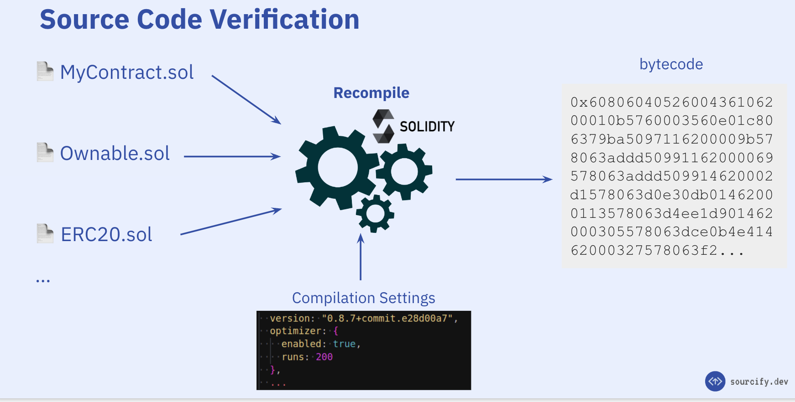
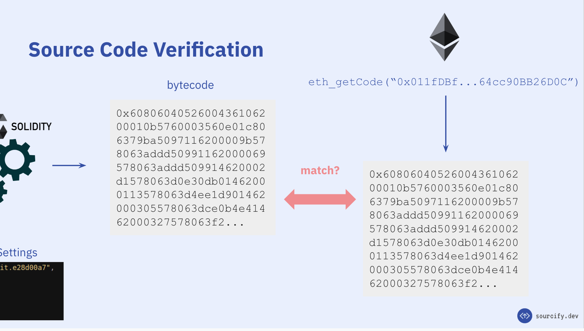

You have probably made use of contract verification before. For many users this is the green checkmark in Etherscan:

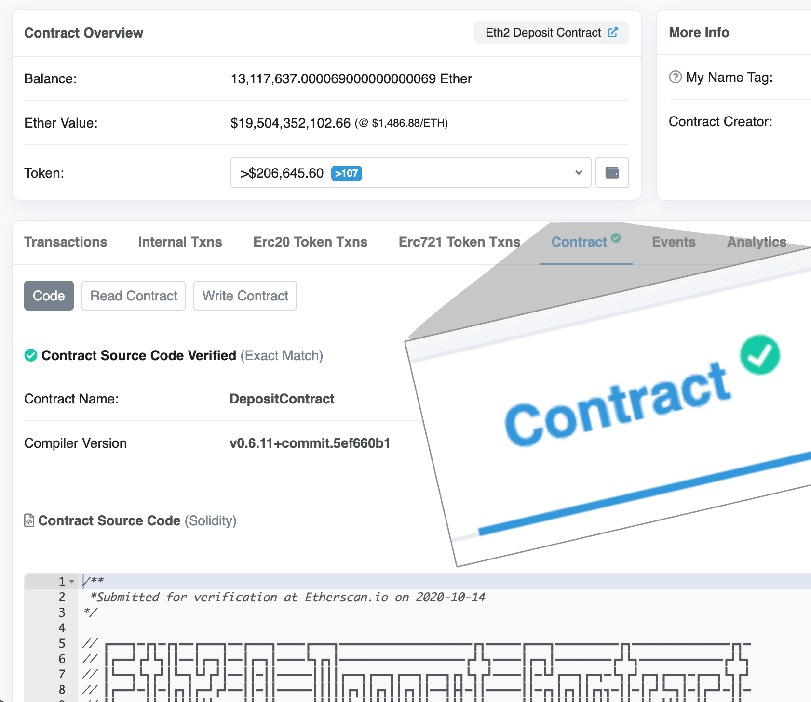

You see the green checkmark and you are happy!

But is it really exactly the same code that is deployed?

The answer is, you don't know 🤷

In fact, no one else would be able to know except the contract developer, and he/she can't really prove it. The reason is, when compiling the contract i.e. translating the human-readable source code (in Solidity or any other higher-level language) to machine-readable bytecode, some information is lost. These include internal variable names, internal function names, names of contracts etc.

So yes this is _functionally_ the same code as deployed: it compiles to the same bytecode as the original mysterious source code 🕵.

And you might be thinking, sure this is good enough. But:

- Someone can insert misleading comments, (internal) function or variable names
- Whoever verifies a contract first is chosen as the matching result, not the "authentic" one
- We can't verify things other than the contract's code itself (i.e. metadata)

In fact when not verified properly, [it is possible](https://samczsun.com/hiding-in-plain-sight/) to inject code that would be shown in the verified source code.

Enough bad news... There's actually a way to verify Solidity contracts that would _cryptographically_ ensure the exactness of the source files and it is already here: It's called Sourcify!

This way of verifying contracts is what we call a **perfect verification**, (in contrast to partial verification). This is enabled by the [Solidity contract metadata](https://docs.soliditylang.org/en/latest/metadata.html), and that the hash of it is appended to the contract's bytecode. The metadata hash acts as a **fingerprint of the whole compilation** and with the information in the metadata file we can completely reproduce the contract compilation.

## Contract Metadata

The Solidity compiler by default [appends some information](https://docs.soliditylang.org/en/latest/metadata.html#encoding-of-the-metadata-hash-in-the-bytecode) to the contract's bytecode in CBOR encoding. This special field, I like referring to as `auxdata`, usually contains the "Solidity version", the "metadata hash", and occasionally the "experimental" flag. The encoded data and it's decoding looks like this:

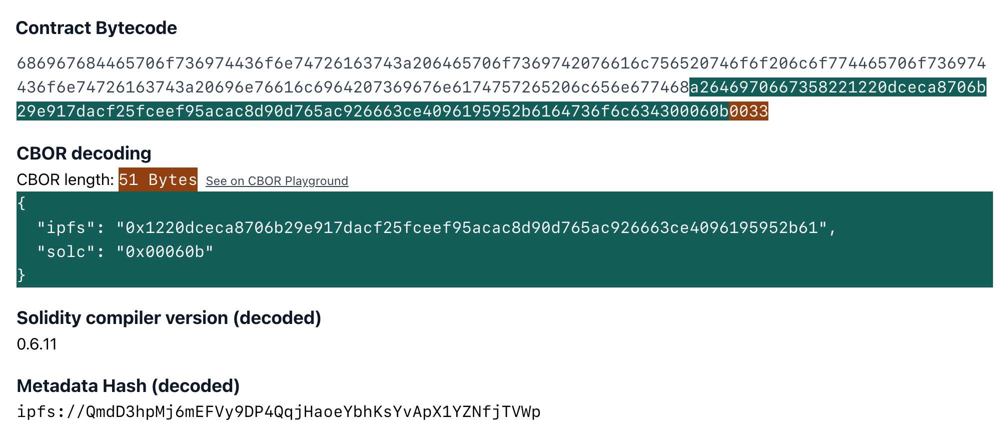

You can actually inspect this field and see the decoding in action for any contract in [playground.sourcify.dev](https://playground.sourcify.dev).

To see how this cryptographically ensures the exactness of the source files we need to look into the contents of the metadata file. The metadata file is a JSON document that [looks like this](https://repo.sourcify.dev/contracts/full_match/5/0x00878Ac0D6B8d981ae72BA7cDC967eA0Fae69df4/metadata.json) and contains information on two things:

1. How to interact with the contract: ABI, documentation
1. How to reproduce a contract compilation: compiler version and settings, source file information

The latter is the relevant field for our purposes. Specifically, the fact that **the metadata file contains source file hashes**. To illustrate this, let's walk through what happens when you compile a contract and what happens when you change a source file.

When you compile a contract, the compiler computes the hashes of the source files and embeds this information in the metadata file. On the right side, you see the relevant fields of the metadata file:

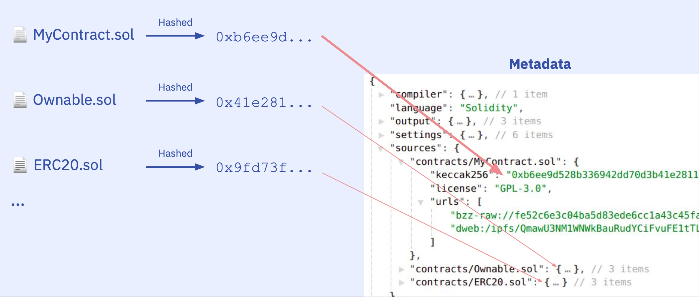

Then the compiler takes the hash of this whole file:

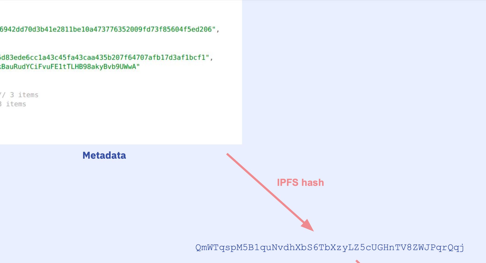

And encodes it in the `auxdata` at the end of the bytecode:

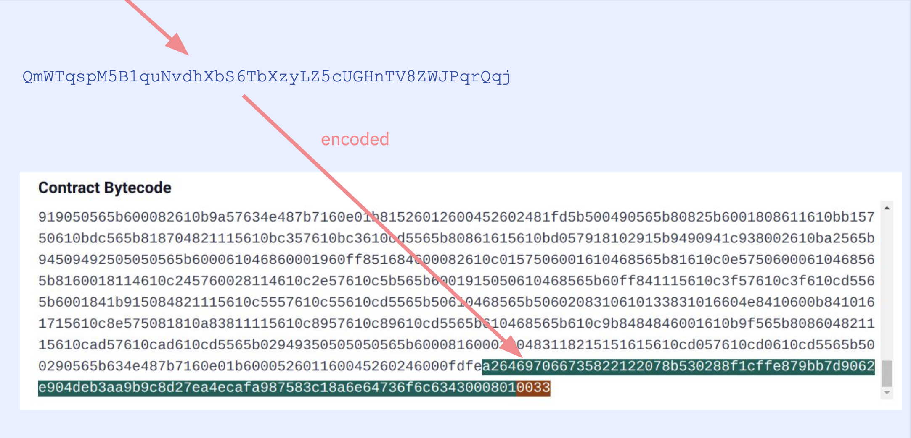

So if you were to decode the `auxdata` you'd see:

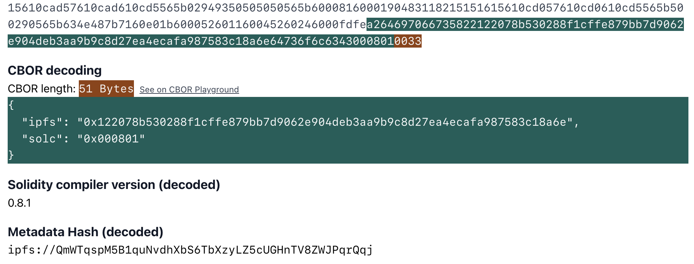

What happens when we change something in the source files? Say we change a variable name or a comment in the new **MyContract-diff.sol** file. In turn the hash of the file changes, as well as the hash in the metadata:

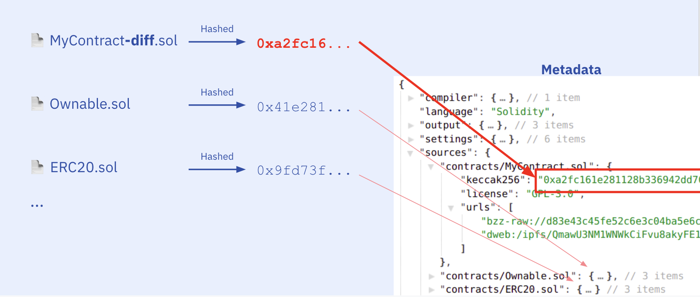

...and of course the hash of the metadata file changes:

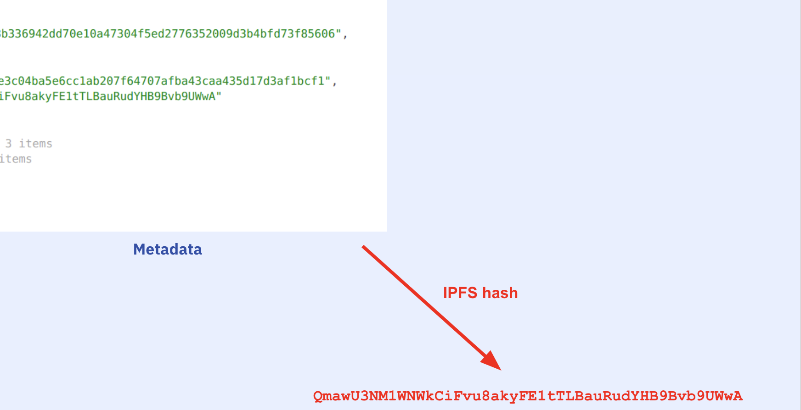

...and the `auxdata` changes:

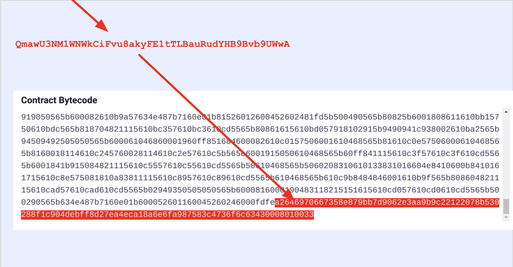

Sooo, if we match both the bytecode + the appended `auxdata`, we have byte-by-byte exactly the same source code and compilation settings of the original deployed contract. This is a **perfect verification**.

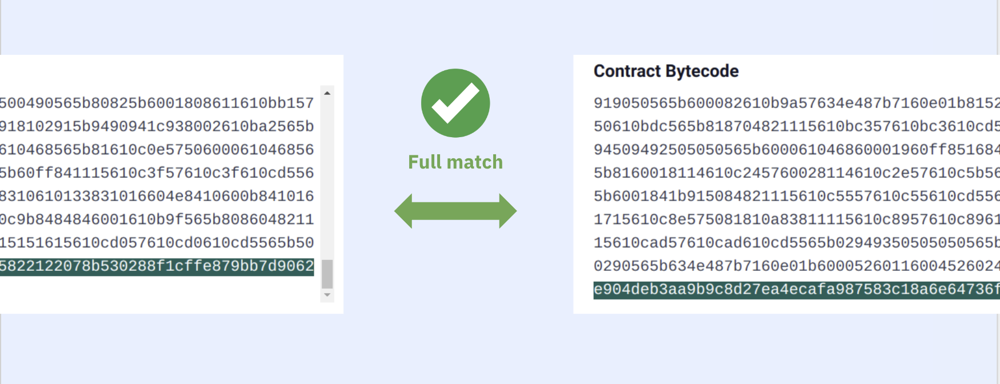

If the bytecode matches but not the `auxdata` (which includes the metadata hash), we have a **partial verification**.

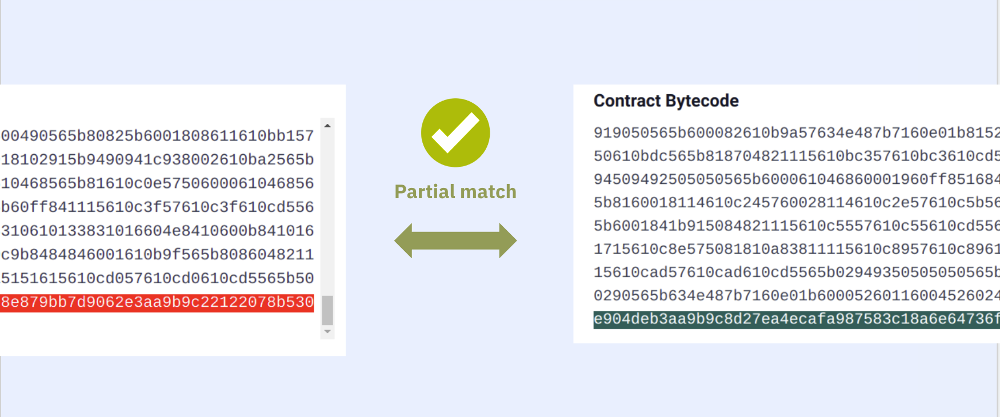

## Did you notice?

If you are familiar with IPFS and paid attention, you might ask: Can't we already get everything from the bytecode itself?

And yes, if published on IPFS, you can actually fetch the source code from the bytecode of a contract, because all the information is already there:

- The metadata IPFS hash is appended to the bytecode so (if published) you can fetch the metadata file.
- The metadata file contains (alongside the normal keccak256) the IPFS hashes of the source files so you can fetch the complete source code from IPFS.

So there's only one thing that you need to do as a contract developer: **Publish your source files and metadata on IPFS**.

Why do you need verification then? Isn't the source file already out there?

Although unlikely since the compiler does it automatically, someone can change the `auxdata` of the contract before deploying it and show you a different random source code. We make sure it really is the same code by doing a whole recompilation of the provided files and comparing the resulting bytecodes. Plus, we share all verified contracts in our [repository on IPFS](https://ipfs.io/ipns/repo.sourcify.dev) to make sure it's available.

## Conclusion

Perfect verification enables more secure and transparent verification on contracts, as well as other useful things such as decoding tx's and enabling human-readable contract interactions, but this is a topic for another article.

Next level smart contract verification is already here. We just need to adopt this way of verifying contracts as a community. Obviously, we need a lot of tooling, integrations, and more awareness. Let's step up and make this the standard way of verifying contracts!

(This article is a summary of my recent talks about Sourcify. If you are interested in learning more, check out one of the [latest talks](https://www.youtube.com/watch?v=cgKrRt6B0Ps))
