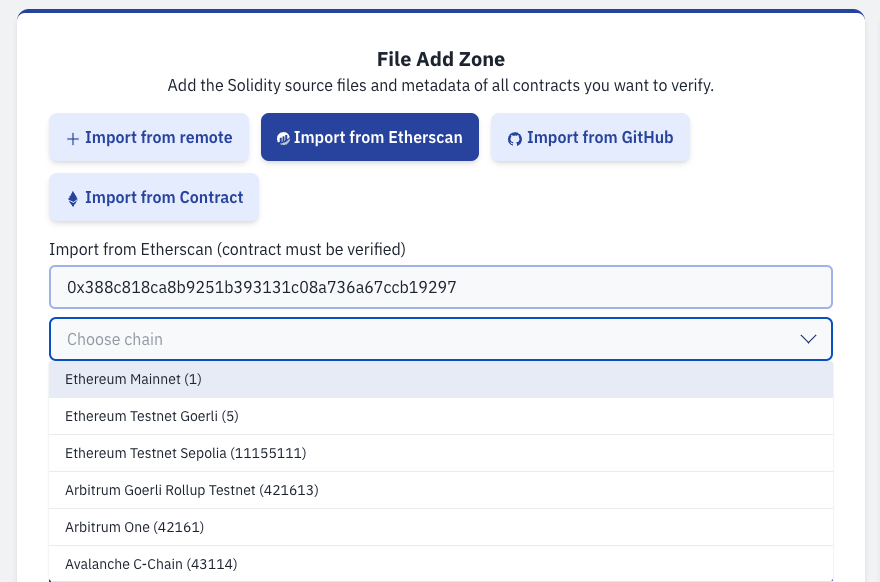

# Import from Etherscan

import EtherscanInstances from "./etherscanInstancesTable.tsx";

It is possible to import contracts already verified on Etherscan instances.

Usually, if the contract is verified via the "Standard JSON Input", it reveals a "full match" instead of "partial".

Sourcify supports the following Etherscan instances

<EtherscanInstances />
